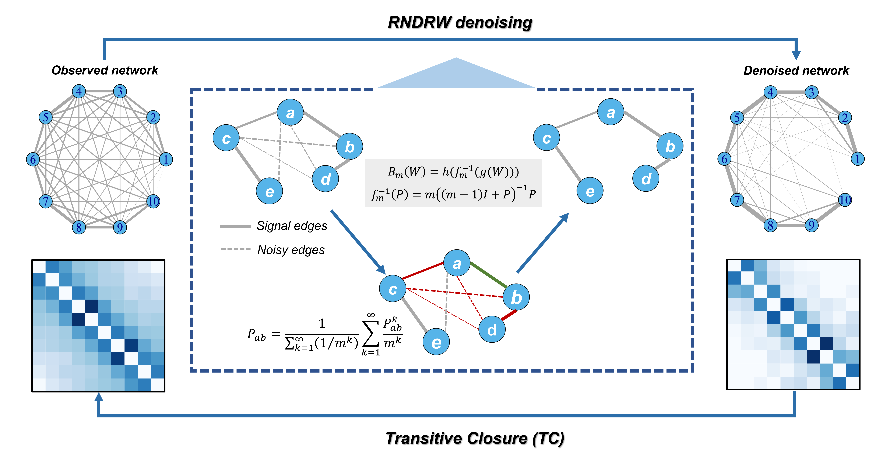

------------------------------------------------------------------------------------------------------
# RENDOR method for removing indirect noise
Removing indirect noise for better inference of gene regulatory networks.

## Authors
- yujiating@amss.ac.cn
- lywu@amss.ac.cn

## Pipeline

  

 

## Reproduce results
For reproducibility, we provide all the necessary scripts and data.

To reproduce the code for the case you desire, simply enter the corresponding folder and run the code step by step. 

For example, if you want to reproduce the results of RENDOR on	simulated data, enter the folder labeled `1. Simulated`, and run the code in the following sequence:
- S01_Test_cycle.R
- S02_Generate_simulated_data.R
- S03_Evaluation_AUPR_ROC.R